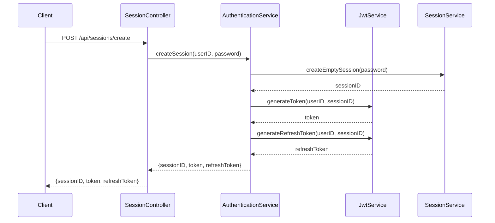
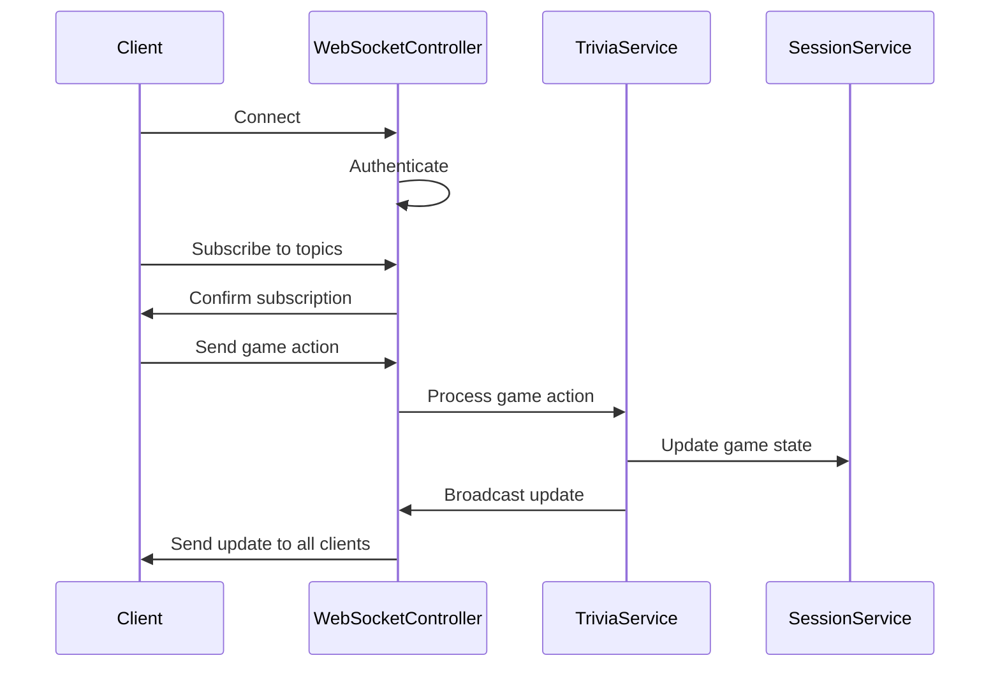
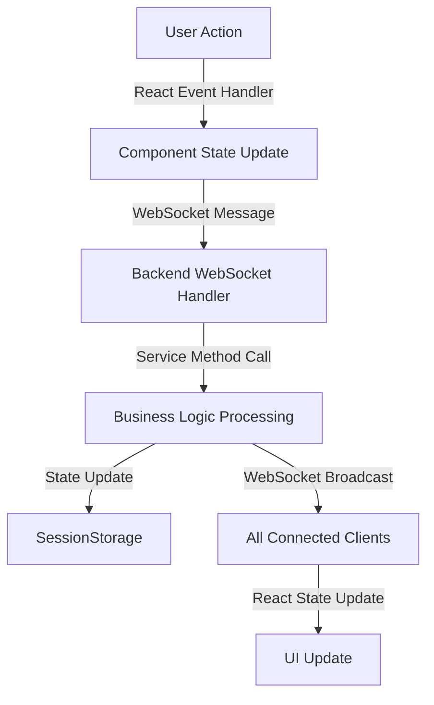

# Music Trivia Design Document

## Overview

The Music Trivia Application is a real-time multiplayer game where users can create or join trivia sessions, answer music-related questions, and compete with each other. The application consists of a Spring Boot backend and a React frontend, communicating via RESTful APIs and WebSocket for real-time updates. 

## Video Demo
https://www.youtube.com/watch?v=RmIhncpdcmc

## Key Features

1. **Real-time Multiplayer**: Users can create or join game sessions and play together in real-time.
2. **JWT Authentication**: Secure authentication using JSON Web Tokens.
3. **WebSocket Communication**: Real-time updates and game state management using WebSockets.
4. **Responsive Design**: The frontend is built with React and features a responsive design for various screen sizes.
5. **RESTful API**: The backend provides a RESTful API for session management and game operations.
6. **External API Integration**: Trivia questions are fetched from an external API (OpenTrivia DB).

## 2. System Architecture

The application follows a client-server architecture with the following main components:

1. **Frontend**: React-based Single Page Application (SPA)
2. **Backend**: Spring Boot application
3. **Database**: In-memory storage (SessionStorage)
4. **Communication**: RESTful APIs for session management, WebSocket for real-time game updates

### High-Level Architecture Diagram

## 3. Backend Design

### 3.1 Main Components

1. **Controllers**: Handle HTTP requests and WebSocket messages
   - SessionController: Manages session creation and joining
   - WebSocketController: Handles real-time game events

2. **Services**: Contain business logic
   - SessionService: Manages session lifecycle and user management
   - TriviaService: Handles game logic, question fetching, and scoring
   - JwtService: Manages JWT token generation and validation
   - AuthenticationService: Handles user authentication

3. **Models**: Represent data structures
   - Session: Represents a game session
   - User: Represents a player in the game
   - TriviaQuestion: Represents a single trivia question

4. **Configuration**: Sets up application configuration
   - WebSocketConfig: Configures WebSocket
   - SecurityConfig: Sets up security settings
   - CorsConfig: Configures CORS settings

### 3.2 Key Design Patterns

1. **Singleton**: Used for SessionStorage to ensure a single instance manages all sessions
2. **Observer**: Implemented through WebSocket subscriptions for real-time updates
3. **Factory**: Used in JwtService for creating different types of tokens

### 3.3 Authentication Flow

### 3.4 WebSocket Communication

## 4. Frontend Design

### 4.1 Main Components

1. **App**: Main component that sets up routing
2. **Home**: Landing page with options to create or join a session
3. **CreateSession**: Form for creating a new game session
4. **JoinSession**: Form for joining an existing session
5. **Lobby**: Waiting room for players before the game starts
6. **TriviaGame**: Main game component where questions are displayed and answered
7. **PlayerInfo**: Displays information about players and their scores
8. **WebSocketManager**: Manages WebSocket connections and message handling

### 4.2 State Management

The application uses React's built-in state management (useState and useEffect hooks) for local component state. For more complex state management, it relies on prop drilling and lifting state up to parent components.

### 4.3 WebSocket Integration

The WebSocketManager is a singleton class that manages the WebSocket connection, subscribes to topics, and provides methods for sending messages. Components use this manager to send and receive real-time updates.

### 4.4 Key React Patterns Used

1. **Functional Components**: All components are implemented as functional components
2. **Hooks**: useState, useEffect, useCallback, and useMemo are used extensively
3. **React Router**: Used for navigation between different views
4. **Conditional Rendering**: Used to display different UI based on game state

## 5. Data Flow

## 6. Security Considerations

1. **JWT Authentication**: Used for securing both HTTP and WebSocket communications
2. **CORS Configuration**: Properly configured to allow only the frontend origin
3. **Input Validation**: Implemented on both frontend and backend
4. **WebSocket Authorization**: Custom handler to validate WebSocket connections

## 7. Scalability and Performance

1. **In-Memory Storage**: Currently uses in-memory storage, which may need to be replaced with a distributed cache or database for horizontal scaling
2. **WebSocket Connections**: May require a separate WebSocket server or clustering for handling a large number of concurrent connections
3. **Question Fetching**: Currently fetches questions in real-time, which may be optimized by pre-fetching and caching questions

## 8. Future Improvements

1. Implement persistent storage for user accounts and game history
2. Add more game modes and question types
3. Implement a leaderboard system
4. Enhance error handling and user feedback
5. Optimize performance for handling larger numbers of concurrent games

